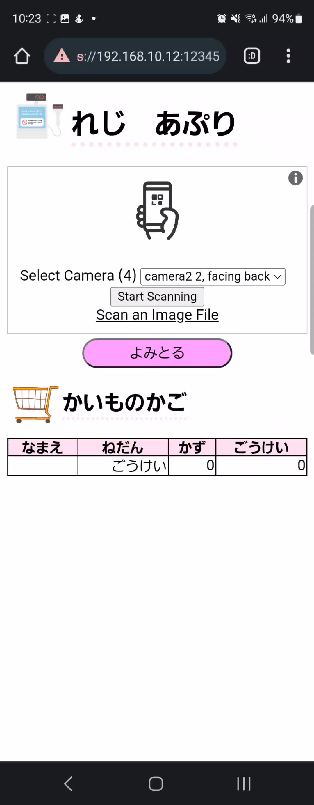
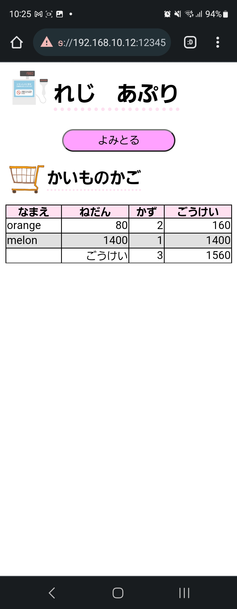
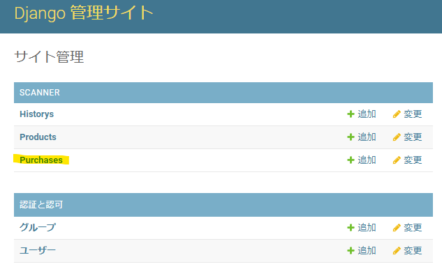

# register_game

register game using qr code scan for my niece

## Used language and frameworks

- Python (3.10.8)
- Django (4.1)
- Django-sslserver (0.22)
- Django-compressor (4.1)
- Django-sass-processor (1.2.2)
- Django-extensions (3.2.1)
- HTML5
  
## How to run

on same directory with manage.py, and run command below

```
 $ python manage.py runsslserver --certificate ./ssl/server.crt --key ./ssl/server.key [Your Local IP Address]:12345
```

Now, you can access 「https://[Your Local IP Address]:12345/scanner」and 「https://[Your Local IP Address]:12345/admin」
UserName and Password is same.「admin」

When open 「https://[Your Local IP Address]:12345/scanner」, you can see the page like below.


You can scan multiple QR codes like below.


## Add New Product

1. open Admin page and click 'Products'.
   
2. click 'Add Product' and fill forms.
   - Product name(required):string
   - Price(required):number
   - Description(optional):string
3. click 'Save'
4. open 「https://www.the-qrcode-generator.com/ 」and enter
   {"product_id":"[ID which you can check on Products in Admin page]"}
5. save generated QR code.

About 4 ~ 5, you can use other QR Code Generator servises or programs(of course, you can use python libraries)


